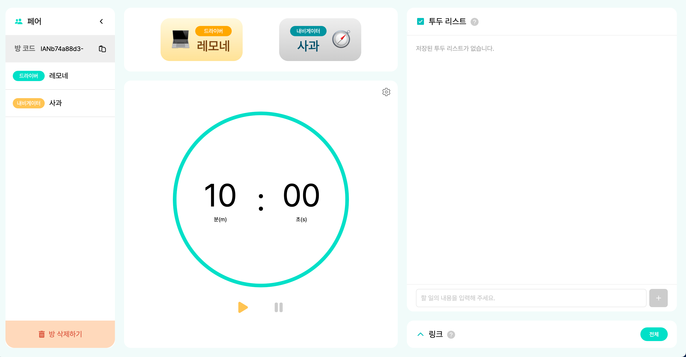

# Server-Sent-Event로 팀 프로젝트에 동기화 적용하기

안녕하세요, 우아한테크코스 6기 레모네 입니다.  
페어 프로그래밍을 돕는 서비스인 “코딩해듀오” 프로젝트에 참여하며 동기화를 적용해 보았는데요,  
SSE를 적용한 배경부터 구현 방법까지 알아보도록 하겠습니다.  

## 동기화가 필요해
저희 서비스에서 “페어룸 만들기" 버튼을 누르면 페어 프로그래밍을 할 수 있는 공간을 생성할 수 있습니다.  

이 공간이 “페어룸" 입니다.  
해당 페어룸에 *한 명의 사용자*만 접속하고 있다면 큰 문제가 발생하지 않습니다.  
그러나 페어룸에 *여러 사용자*가 접속하게 된다면 한 가지 고려해야 할 점이 생깁니다.  
바로 `타이머 동기화` 입니다.  
만약 타이머가 동기화 되지 않는다면 어떤 상황이 발생할까요?  
> ~ 레모네와 사과가 페어프로그래밍을 진행하고 있다~  
🍋 : 페어룸 만들었어. 이제 타이머 시작할게!  
🍎 : 타이머를 내 노트북으로도 확인하고 싶으니까 레모네가 만든 페어룸에 접속해야겠다. 어, 그런데 타이머 화면이 레모네와 다르네?  

위의 사진을 바탕으로 레모네(왼쪽 타이머)와 사과(오른쪽 타이머)의 화면을 비교해 봅시다.  
레모네의 타이머는 실행되고 있지만, 사과의 타이머는 중지 상태이다.  
레모네의 타이머는 실행 중이기 때문에 `일시정지` 버튼이 활성화 되어있고, 사과의 타이머는 중지 상태이기 때문에 `실행` 버튼이 활성화 되어있다.  

이렇게 다중 사용자가 실시간으로 변화하는 *동일한 화면*을 바라보아야 할 때, `동기화` 가 필요합니다.  

## 웹소켓 vs SSE
동기화를 하려면 모든 사용자에게 *실시간으로 같은 데이터*를 전송해야 합니다.  
가장 많이 쓰이는 **실시간 통신** 기술로는 `웹소켓`과 `SSE`가 있습니다.  
두 기술을 비교하며 저희 서비스에 어떤 방식이 더 적절할지 찾아봅시다.  

### SSE (Server-Sent-Event)
SSE는 **http 프로토콜** 기반 실시간 통신 방법입니다.  
SSE의 특징은 **단방향 통신**이라는 점인데요, `서버에서 클라이언트 방향`으로만 데이터를 전송할 수 있습니다.  

클라이언트가 SSE 통신을 시작하고 싶다는 요청을 보내면,  
서버는 SSE `커넥션` 을 생성합니다.  
이 `커넥션`으로 서버가 클라이언트에게 데이터를 전송하게 됩니다.  
(물론 커넥션이 닫히면 해당 커넥션으로 더이상 데이터를 보낼 수 없습니다.)  

<이미지 출처: https://bigboxcode.com/server-sent-events-sse>

http 프로토콜 특성상 `요청-응답 주기`가 반복되어야 할텐데, 어떻게 요청이 없는데도 서버가 지속적으로 클라이언트에게 데이터를 전송할 수 있을까요?
정답은 서버가 보내는 데이터가 *하나의 응답이 아닌*, chunk 단위의 `스트림`이기 때문입니다.

간단하게 말하자면
> 응답 데이터를 전송할건데, 데이터를 작은 단위로 쪼개서 계속 보낼거야. 데이터를 다 보냈다고 내가 말하기 전까지 응답을 완료 처리하지마!

라는 의미입니다.
결국 하나의 요청에 하나의 응답이라는 특성은 유지한 채, 데이터를 지속적으로 클라이언트에게 전송할 수 있는 것이죠.
커넥션이 끊어질 때까지 클라이언트는 서버가 보내는 데이터를 실시간으로 받을 수 있습니다.

이러한 특징 때문에 SSE는 **알림** 시스템을 구축할 때 주로 사용됩니다.
웹소켓
웹소켓은 `웹소켓 프로토콜` 기반 실시간 통신입니다. SSE처럼 http 프로토콜을 사용하지 않고, 웹소켓 전용  프로토콜을 사용합니다.
SSE와 차별화된 또 다른 특징은 `양방향 통신`을 한다는 점입니다.
양방향 통신이 가능하다는 것은, **클라이언트와 서버가 동시**에 데이터를 주고받을 수 있다는 뜻입니다.
http 프로토콜에서는 클라이언트의 요청이 올 때까지 기다린 뒤 응답을 보내거나, 서버에서 클라이언트 방향(단방향)으로만 데이터를 전송할 수 있었습니다.

그러나 웹소켓은 서버가 클라이언트의 요청 없이 응답할 수도 있고, 클라이언트가 응답 없이 여러번 요청할 수 있습니다.
사실상 `클라이언트와 서버`, `요청과 응답`이 서로 구별되지 않는 *동등한 상태*가 되는 것이죠.

그래서 웹소켓은 `채팅` 애플리케이션에 주로 쓰입니다.
그래서 어떤 기술을 사용할까?
지금까지 SSE와 웹소켓에 대해 알아보았습니다.
이제 어떤 방식을 선택할지 결정할 시간이 되었네요.

타이머를 실행하고 중지할 때 타이머 시간이
타이머 시작 버튼을 누르면, 타이머 시간이 1초마다 줄어든다.
타이머 일시정지 버튼을 누르면, 타이머 시간이 유지된다.

타이머 시작 요청을 보냈을 때, 1초씩 줄어드는 시간 정보만 필요하다는 것을 알 수 있습니다.
타이머 시간을 1초마다 클라이언트에게 전송해 주면 되겠네요.

그럼 여기서 떠오르는 기술이 하나 있을 텐데요, 바로 SSE 입니다.
웹소켓이 제공하는 양방향 통신의 이점이 타이머 동기화에 필수적이지 않기 때문에 SSE를 사용하는게 더 적절해 보입니다.

이제 본격적으로 구현을 시작해 봅시다.
타이머 시간 동기화하기
“코딩해듀오”는 `스프링 부트`를 사용하고 있기 때문에 `스프링 부트`를 기반으로 SSE를 구현해 보겠습니다.
1) 커넥션 생성
   먼저 페어룸에 접속한 클라이언트와 SSE 커넥션을 맺어야 합니다.

``` java
@RestController
public class SseController implements SseDocs {


   private final SseService sseService;


   @GetMapping("/{key}/connect")
   public ResponseEntity<SseEmitter> createConnection(@PathVariable("key") final String key) {
       final SseEmitter sseEmitter = sseService.connect(key);


       return ResponseEntity.ok(sseEmitter);
   }
```
컨트롤러에 SSE 커넥션 생성 요청 api를 추가해 줍시다.
참고로 엔트포인트에 있는 `{key}`는 페어룸을 식별할 수 있는 코드입니다.

`sseService.connect()` 가 어떻게 구현되어 있는지 자세히 살펴봅시다.

``` java
@Service
public class SseService {


   private final EventStreamsRegistry eventStreamsRegistry;


   public SseEmitter connect(final String key) {
       final SseEmitter emitter = eventStreamsRegistry.register(key);
       return emitter;
   }
```
eventStreamRegistry에서 key(페어룸 식별자)에 해당하는 SseEmitter를 생성하고, 해당 SseEmitter를 반환하고 있습니다.

SseEmitter는 SSE를 구현할 수 있도록 스프링이 제공하는 클래스로 이 객체를 통해 데이터를 전송할 수 있습니다.
`SseEmitter = 커넥션`인 셈이죠.
SseEmitter 객체로 어떤 일을 할 수 있는지는 뒤에서 자세하게 설명하겠습니다.

EventStreamRegistry를 살펴봅시다.

``` java
@Component
public class EventStreamsRegistry {


   private final Map<String, EventStreams> registry;


   public EventStreamsRegistry() {
       this.registry = new ConcurrentHashMap<>();
   }


   public SseEmitter register(final String key) {
       final EventStreams eventStreams = registry.getOrDefault(key, new EventStreams());
       final EventStream eventStream = new SseEventStream();
       eventStreams.add(eventStream);
       registry.put(key, eventStreams);
       return eventStreams.publish(eventStream);
   }
```
register 메서드의 역할을 요약하자면 Map 자료구조를 가진 `registry`에 **페어룸 식별자**를 key로, **EventStreams**을 value로 저장하고, `eventStreams.publish` 메서드로 SseEmitter를 생성합니다.

EventStreams는 `List<EventStream>`을 필드로 갖고있는 일급 컬렉션입니다.
EventStream은 `SseEmitter` 객체를 이용해 커넥션을 맺거나, 데이터를 전송하는 인터페이스입니다.

코드가 조금 복잡해졌기 때문에, 잠깐 셀프 Q&A 시간을 갖겠습니다.
Q) 왜 페어룸 식별자 별로 EventStreams를 보관하나요?
A) 페어룸 별로 타이머를 독립적으로 동기화 해야 하기 때문입니다. “하나의 페어룸"에 대해 타이머 동기화를 해야 하는데, “모든 페어룸"에 대해 타이머 동기화를 하면 큰 일이 발생하겠죠?
Q) EventStream이 아닌 EventStreams로 보관하는 이유가 무엇인가요?
A) 다중 사용자를 고려했기 때문입니다. 클라이언트 한 명당 하나의 커넥션이 존재하기 때문에 SseEmitter도 클라이언트 수만큼 필요합니다. 그래서 페어룸에 존재하는 모든 사용자들을 List<EventStream>로 관리합니다.


이제 EventStreams에 대해 알아보겠습니다.

``` java
public class EventStreams {


   private final List<EventStream> streams = new CopyOnWriteArrayList<>();


   public SseEmitter publish(final EventStream eventStream) {
       final SseEmitter sseEmitter = eventStream.connect();
       sseEmitter.onTimeout(sseEmitter::complete);
       sseEmitter.onCompletion(() -> streams.remove(eventStream));
       sseEmitter.onError(error -> streams.remove(eventStream));
       return sseEmitter;
   }

```
인자로 받은 EventStream으로 커넥션을 생성합니다.
커넥션 생성 후 커넥션이 `타임아웃` 될 경우, 커넥션이 `종료`될 경우, 커넥션에 `오류`가 발생할 경우 어떤 행동을 할지 `콜백 함수`를 지정합니다.
코드에서는 위의 세가지 상황이 발생했을 때 streams에서 해당 EventStream을 삭제합니다.

EventStream의 구현체인 SseEventStream에 대해 알아보겠습니다.
``` java
public class SseEventStream implements EventStream {


   private static final Duration TIME_OUT = Duration.ofMinutes(20);
   private static final String CONNECT_NAME = "connect";
   private static final String SUCCESS_MESSAGE = "OK";


   private final AtomicLong id = new AtomicLong(0);
   private final SseEmitter sseEmitter;


   public SseEventStream() {
       this.sseEmitter = new SseEmitter(TIME_OUT.toMillis());
   }


   @Override
   public SseEmitter connect() {
       final String eventId = String.valueOf(id.incrementAndGet());
       try {
           sseEmitter.send(SseEmitter.event()
                   .id(eventId)
                   .name(CONNECT_NAME)
                   .data(SUCCESS_MESSAGE));
       } catch (final IOException e) {
           sseEmitter.complete();
           throw new SseConnectionFailureException("SSE 연결이 실패했습니다.");
       }
       return sseEmitter;
   }
```
SseEmitter의 기본 타임아웃 시간은 30초입니다. 30초 뒤에 무조건 커넥션이 끊어진다는 의미입니다.
보통 타임아웃은 아무런 데이터가 전송되지 않는 *유휴 상태가 지속될 경우*를 뜻하지만, SseEmitter의 경우 지속적으로 데이터가 전송되고 있더라도 첫 데이터 전송 시간으로부터 30초가 지나면 무조건 타임아웃이 발생합니다.
타임아웃이 발생하면 더이상 커넥션을 사용할 수 없기 때문에 새로운 커넥션을 생성해 주어야 합니다.

SseEmitter를 생성할 때 타임아웃 시간을 지정해 줄 수 있는데, 저는 20분으로 설정해 주었습니다.

connect 메서드를 살펴보면, SseEmitter 객체를 통해 데이터를 전송하고 있습니다.
커넥션 연결에 성공했을 시 name은 “connect”, data는 “OK”가 전송됩니다.

개발자 도구를 열어 네트워크 창의 EventStream을 확인하면 아래와 같은 화면을 확인할 수 있습니다.


SSE 커넥션을 맺는 것에 성공했습니다.
이제 타이머를 시작해 봅시다.
2 - 타이머 시작
@RestController
public class TimerController implements TimerDocs {


private final SchedulerService schedulerService;


@PatchMapping("/{accessCode}/timer/start")
public ResponseEntity<Void> createTimerStart(@PathVariable("accessCode") final String accessCode) {
schedulerService.start(accessCode);
return ResponseEntity.noContent()
.build();
}

컨트롤러에 타이머 시작 요청 api를 추가합니다.
accessCode는 페어룸 식별자를 뜻합니다. SSE 커넥션을 맺을 때 사용되었던 key와 같습니다.

SchedulerService를 살펴봅시다.
``` java
public void start(final String key) {
   if (schedulerRegistry.isActive(key)) {
       return;
   }
   sseService.broadcast(key, "timer", "start");
   if (isInitial(key)) {
       final Timer timer = timerRepository.fetchTimerByAccessCode(key)
               .toDomain();
       scheduling(key, timer);
       timestampRegistry.register(key, timer);
       return;
   }
   final Timer timer = timestampRegistry.get(key);
   scheduling(key, timer);
}


private boolean isInitial(final String key) {
   return !schedulerRegistry.has(key) && !timestampRegistry.has(key);
}


private void scheduling(final String key, final Timer timer) {
   final Trigger trigger = new PeriodicTrigger(DELAY_SECOND);
   final ScheduledFuture<?> schedule = taskScheduler.schedule(() -> runTimer(key, timer), trigger);
   schedulerRegistry.register(key, schedule);
}


private void runTimer(final String key, final Timer timer) {
   if (timer.isTimeUp() && schedulerRegistry.has(key)) {
       stop(key, timer);
       return;
   }
   if (sseService.hasNoConnections(key) && schedulerRegistry.has(key)) {
       pause(key);
       return;
   }
   timer.decreaseRemainingTime(DELAY_SECOND.toMillis());
   sseService.broadcast(key, "remaining-time", String.valueOf(timer.getRemainingTime()));
}
```

코드가 복잡하니 메서드 하나씩 천천히 살펴봅시다.

``` java
public void start(final String key) {
   if (schedulerRegistry.isActive(key)) {
       return;
   }
   sseService.broadcast(key, "timer", "start");
   if (isInitial(key)) {
       final Timer timer = timerRepository.fetchTimerByAccessCode(key)
               .toDomain();
       scheduling(key, timer);
       timestampRegistry.register(key, timer);
       return;
   }
   final Timer timer = timestampRegistry.get(key);
   scheduling(key, timer);
}
```
start 메서드에서는 먼저 타이머가 **실행되었다가 중단**된 상태인지, 아니면 **한번도 실행되지 않은** 상태인지를 구분합니다.
두 상태를 구분하는 이유는 타이머 총 시간은 `DB`에서 관리하지만, 타이머의 현재 시간, 즉 타이머 남은 시간은 `인메모리`로 관리하고 있기 때문입니다. 타이머 시간이 1초씩 줄어들 때마다 db에 업데이트 할 수 없기 때문에 타이머 남은 시간은 TimeStampRegistry에서 관리하고 있습니다.

타이머가 한번도 실행되지 않았다면 TimeStampRegistry에 타이머 시간이 저장되어 있지 않은 타이머 초기화 상태이기 때문에 DB에서 타이머 총 시간을 가져옵니다.
타이머가 실행되었던 적이 있다면(실행 후 일시정지 상태), TimeStampRegistry에서 타이머 현재 시간을 가져옵니다.
DB, 혹은 TimeStampRegistry에서 가져온 시간을 이용해 스케줄링을 시작합니다.

Q) 갑자기 스케줄링은 왜 등장하나요?
A) 사용자가 타이머 일시정지 버튼을 누르기 전까지 *자동으로* 타이머 현재 시간을 1초마다 전송해야 하기 때문입니다.

private void scheduling(final String key, final Timer timer) {
final Trigger trigger = new PeriodicTrigger(DELAY_SECOND);
final ScheduledFuture<?> schedule = taskScheduler.schedule(() -> runTimer(key, timer), trigger);
schedulerRegistry.register(key, schedule);
}

스케줄러 실행 주기는 1초마다 시간을 전송해야 하므로 `1초`로 설정했습니다.
ThreadPoolTaskScheduler를 활용해 1초에 한번씩 runTimer 메서드가 실행되도록 해 주었습니다.
스케줄러 실행 결과는 페어룸 식별자 별로 SchedulerRegistry에 저장됩니다.

``` java
private void runTimer(final String key, final Timer timer) {
   if (timer.isTimeUp() && schedulerRegistry.has(key)) {
       stop(key, timer);
       return;
   }
   if (sseService.hasNoConnections(key) && schedulerRegistry.has(key)) {
       pause(key);
       return;
   }
   timer.decreaseRemainingTime(DELAY_SECOND.toMillis());
   sseService.broadcast(key, "remaining-time", String.valueOf(timer.getRemainingTime()));
}
```
runTimer에서는 타이머 현재 시간을 1초 줄이고, 페어룸에 있는 모든 클라이언트에게 남은 시간을 전송합니다.

전송 과정을 구체적으로 살펴보면,
페어룸 식별자로 EventStreams 찾고, 해당 EventStreams에 broadcast 적용
``` java
public void broadcast(final String key, final String event, final String data) {
   final EventStreams emitters = eventStreamsRegistry.findEventStreams(key);
   emitters.broadcast(event, data);
}
```
List<EventStream>의 모든 요소를 대상으로 flush 수행
```java
public void broadcast(final String name, final String message) {
   streams.forEach(eventStream -> eventStream.flush(name, message));
}

EventStream(SseEventStream)의 필드인 SseEmitter로 데이터 전송
``` java
@Override
public void flush(final String name, final String message) {


   final String eventId = String.valueOf(id.incrementAndGet());
   try {
       sseEmitter.send(SseEmitter.event()
               .id(eventId)
               .name(name)
               .data(message)
       );
   } catch (final IOException ignored) {
   }
}
```
다시 runTimer로 돌아가겠습니다.
``` java
   private void runTimer(final String key, final Timer timer) {
       if (timer.isTimeUp()) {
           stop(key);
           final Timer initalTimer = new Timer(timer.getAccessCode(), timer.getDuration(), timer.getDuration());
           timestampRegistry.register(key, initalTimer);
           return;
       }
       if (sseService.hasNoConnections(key)) {
           stop(key);
           return;
       }
       timer.decreaseRemainingTime(DELAY_SECOND.toMillis());
       sseService.broadcast(key, "remaining-time", String.valueOf(timer.getRemainingTime()));
   }
```
타이머 현재 시간이 0초가 된다면(타이머가 한바퀴 돌았을 때), 타이머를 정지하고 타이머 현재 시간을 타이머 총 시간으로 초기화 합니다.
페어룸에 사용자가 아무도 없을 경우에도 타이머를 정지합니다.
타이머를 중지하는 stop 메서드는 타이머 일시정지 목차에서 설명드리겠습니다.

이제 타이머를 시작하면,

위 사진과 같은 결과를 확인할 수 있습니다.
사진에 있는 타이머 시간은 밀리초 기준으로, 타이머 시간이 1000밀리초(1초)씩 줄어들고 있습니다.
3 - 타이머 일시정지
이제 실행중인 타이머를 일시정지 해 봅시다.
이전 단계와 마찬가지로 타이머 일시정지 api를 추가합니다.
@PatchMapping("/{accessCode}/timer/stop")
public ResponseEntity<Void> createTimerStop(@PathVariable("accessCode") final String accessCode) {
schedulerService.pause(accessCode);


return ResponseEntity.noContent()
.build();
}

schedulerService.pause 메서드를 살펴봅시다.
public void pause(final String key) {
sseService.broadcast(key, "timer", "pause");
schedulerRegistry.release(key);
}

페어룸에 있는 모든 사용자에게 타이머가 정지되었다는 데이터를 전송합니다.
그 후, SchedulerRegistry에서 타이머를 정지하고자 하는 페어룸의 스케줄러를 종료합니다.

@Component
public class SchedulerRegistry {


private final Map<String, ScheduledFuture<?>> registry;


public SchedulerRegistry() {
this.registry = new ConcurrentHashMap<>();
}


public void register(final String key, final ScheduledFuture<?> future) {
registry.put(key, future);
}


public void release(final String key) {
if (!registry.containsKey(key)) {
throw new NotFoundScheduledFutureException("키에 해당하는 스케줄러 결과가 존재하지 않습니다.");
}
registry.get(key)
.cancel(false);
registry.remove(key);
}

SchedulerRegistry는 페어룸 별 스케줄링 결과를 관리합니다.
release 메서드를 살펴보면, registry에서 페어룸 식별자로 페어룸 결과를 가져오고 있습니다.
ScheduledFuture는 스케줄러의 현재 상태를 알 수 있는 스프링이 제공하는 클래스입니다.
ScheduledFuture의 상태를 cancel로 변경하여 실행중이던 스케줄러를 종료하고, 해당 ScheduledFuture를 registry에서 삭제합니다.


성공적으로 타이머가 중단되면, 1초마다 전송되던 타이머 현재 시간이 더이상 전송되지 않고 timer pause 메세지가 마지막으로 전송됩니다.

트러블 슈팅
지금까지 SSE를 사용하여 타이머를 동기화하는 방법에 대해 알아보았습니다.
SSE를 도입하면서 다양한 에러 상황을 마주했는데요, 이 글을 보시는 여러분도 같은 문제를 겪지 않도록 트러블 슈팅 과정을 공유하겠습니다.

문제 1) 타이머 실행/일시중지 버튼이 동기화 되지 않아요
따로 언급하지는 않았지만, 사실 위의 코드 안에 타이머 버튼 동기화 로직이 숨어있었습니다.
타이머를 실행하거나 중지할 때 어떤 이벤트가 발생했는지 알려주는 “이벤트 메세지"를 함께 전송하면 타이머 버튼도 동기화 할 수 있습니다.

타이머 중지 메서드를 보면, 타이머를 중지할 때 “timer pause” 메세지를 함께 전송하고 있습니다.
``` java
public void pause(final String key) {
   sseService.broadcast(key, "timer", "pause");
   schedulerRegistry.release(key);
}

타이머 실행 메서드에서도 “timer start” 메세지를 전송한 뒤 1초마다 타이머 시간을 보내주고 있네요.
``` java
public void start(final String key) {
   if (schedulerRegistry.isActive(key)) {
       return;
   }
   sseService.broadcast(key, "timer", "start");
   if (isInitial(key)) {
       final Timer timer = timerRepository.fetchTimerByAccessCode(key)
               .toDomain();
       scheduling(key, timer);
       timestampRegistry.register(key, timer);
       return;
   }
   final Timer timer = timestampRegistry.get(key);
   scheduling(key, timer);
}
```
이제 프론트엔드 단에서 타이머 실행 버튼을 활성화 할지, 타이머 중지 버튼을 활성화 할지 결정하는 근거는 “start” 메세지가 오느냐, “stop” 메세지가 오느냐에 따라 달라집니다.

타이머 현재 시간을 보내주거나 타이머를 중지하는 일만 하면 되지, 굳이 “timer start”와 “timer stop” 메세지를 추가로 전송했던 이유가 바로 *버튼 동기화* 때문이었습니다.

만약 이벤트 메세지가 없다면, 타이머를 실행했을 때 타이머 실행 버튼을 누른 사용자의 화면만 정지 버튼이 활성화 되고, 페어룸에 있던 다른 사용자는 시작 버튼이 활성화 된 채로 타이머가 진행될 것입니다.
문제 2) 테스트 서버에서 설정한 타임아웃 시간보다 일찍 커넥션이 종료돼요
SseEmitter의 타임아웃 시간을 20분으로 설정했기 때문에 커넥션이 맺어진 뒤 20분이 지나면 커넥션이 자동으로 종료됩니다.
그러나 20분이 되기도 전, `net::ERR_HTTP2_PROTOCOL_ERROR 200` 에러와 함께 커넥션이 1분만에 종료되었습니다.

이 문제는 로컬에서는 발생하지 않았고, 테스트 서버에서 발생하였습니다.

Nginx는 프록시 서버가 무기한 대기하는 것을 방지하기 위해 `proxy_read_time` 옵션으로 응답을 기다리는 최대 시간을 지정할 수 있습니다.
`proxy_read_time` 기본값이 60초이기 때문에 SSE 커넥션도 1분 뒤 종료된 것입니다.

Nginx config 파일에 아래와 같이 타임아웃 시간을 20분으로 설정해 주었더니 정상 동작하였습니다.
```
location /api/ {
    proxy_read_timeout 20m;  
}
```
문제 3) 운영 서버에서 설정한 타임아웃 시간보다 일찍 커넥션이 종료돼요
테스트 서버에서 타임아웃 문제를 해결했더니, 이제는 운영 서버에서 같은 문제가 발생했습니다.
운영 서버는 테스트 서버와 달리 `로드밸런서`를 적용한 상태였습니다.

AWS 로드 밸런서 - Load Balancer 속성 편집에 들어가면 연결 유휴 제한 시간을 설정할 수 있습니다.

유휴 제한 시간이란 애플리케이션에서 사용자가 일정 시간동안 아무런 활동을 하지 않을 경우 연결을 자동으로 종료하는 메커니즘을 말합니다.
유휴 제한 시간 기본값이 1분이기 때문에 커넥션도 1분 뒤 종료된 것입니다.

처음에는 유휴 시간을 타임아웃 시간과 같게 20분으로 설정했으나, 문제가 해결되지 않았습니다.
그래서 유휴 시간을 25분으로 늘려 주었더니 타임아웃 시간보다 일찍 커넥션이 종료되는 문제를 해결할 수 있었습니다.

문제 4) 운영 서버에서 타이머 동기화가 되지 않아요
이게 무슨 상황일까요…😱
코딩해듀오 운영 서버는 AWS 인스턴스를 두대 띄운 상태이고, 로드밸런서가 임의로 두 인스턴스 중 하나의 인스턴스에 트래픽을 전송합니다.
두 인스턴스를 각각 인스턴스 A, 인스턴스 B라고 지칭하겠습니다.

타이머 동기화가 되지 않은 이유는 타이머 현재 시간을 *인메모리*로 관리하고 있기 때문입니다.
동기화에 실패하는 시나리오는 아래와 같습니다.
페어룸에 첫번째 사용자가 입장한다. 해당 사용자는 인스턴스 A를 거쳐 페어룸에 입장힌다.
첫번째 사용자가 총 10분으로 설정된 타이머를 실행한다.
타이머가 3분동안 동작하여 현재 시간이 7분인 페어룸에 두번째 사용자가 입장한다. 해당 사용자는 인스턴스 B를 거쳐 페어룸에 입장한다.
첫번째 사용자의 타이머 현재 시간은 인스턴스 B의 톰캣 인메모리에 저장되어 있지 않다. 그래서 두번째 사용자의 타이머는 7분부터 시작하는 것이 아닌, 초기화 된 상태인 10분부터 동작하기 시작한다.

톰캣 서버가 인스턴스 별로 독립적으로 관리되고 있기 때문에 인메모리 데이터 역시 다른 인스턴스와 공유되지 않습니다.

이 문제를 해결하기 위해 페어룸 식별자 prefix로 `IAN`, `IBN`을 추가하고, 로드밸런서 리스너 규칙 조건으로 경로 패턴을 설정해 주었습니다.

이제부터 식별자가 IAN으로 시작하는 페어룸은 무조건 인스턴스 A로 전달되고,
식별자가 IBN으로 시작하는 페어룸은 무조건 인스턴스 B로 전달됩니다.
마무리
동기화 문제를 해결하기 위해 SSE를 적용하게 된 배경과 구현 방법에 대해 알아보았습니다.

다양한 예외 처리와 데이터 일관성 문제, 인프라 구조에 따른 트러블 슈팅 등 동기화를 적용하는 과정에서 예상치 못한 문제가 발생할 가능성이 높습니다.

서비스의 특성상 SSE를 사용할지, 웹소켓을 사용할지, 혹은 동기화를 적용할 필요가 없는지 꼼꼼하게 분석한 뒤 동기화를 도입하는 것을 추천합니다.
